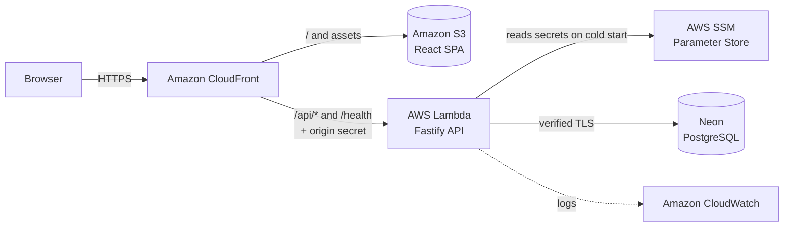

# Memorization

**[Leia em português / Read this in Portuguese](README.md)**

Assignment for the course **AGL11091 - Trends in Software Engineering**.

The main goal is to **study and apply Spec-Driven Development (SDD)** with
[GitHub Spec Kit](https://github.com/github/spec-kit). The product built to
exercise the methodology is a flashcard study web application. A person creates
**Cards** (Front and Back), groups them into **Decks** and practices them in
**Study sessions**, revealing the Back and stating whether they got it right or
wrong. Each **User** has their own collection.

Every feature started from a specification and went through the Spec Kit flow:
*specify → clarify → plan → tasks → analyze → implement → converge*. Code was
only written after the spec, the plan and the tasks were approved, and every
current requirement is cited by at least one test that verifies it.

The project presentation is at
**<https://claude.ai/artifact/JrKYwYHpCGipXnW7ePwKfN>**.

> The specs, the domain glossary and the code use Portuguese terms (`Cartão`,
> `Baralho`, `Sessão de estudo`, `Usuário`, `Senha`, `Credencial`). This README
> translates them as Card, Deck, Study session, User, Password and Credential.

## Stack

| Layer | Technology |
|---|---|
| Language | TypeScript end to end, on Node.js 24+ |
| Backend | Fastify, with input validation by Zod |
| Frontend | React with Vite (SPA with hash navigation) |
| Persistence | Storage Port with two Adapters: SQLite (`node:sqlite`) when running locally and PostgreSQL (`pg`) in the cloud |
| Security | Password with a per-User salt, HMAC-SHA256 with a server secret and scrypt; Credential sent on every request, with no session or cookie |
| Tests | Vitest and Testing Library; E2E with Playwright in a real browser, against the real API and database |
| Infrastructure | AWS provisioned with OpenTofu; PostgreSQL database on Neon |
| AI-assisted development | [Claude Code](https://claude.com/claude-code) as Architect and orchestrator: drives Spec Kit, decides the architecture, reviews and integrates. The code is written by **DeepSeek flash workers**, each in an isolated worktree |
| Prompts | [`prompts.md`](prompts.md) collects every prompt the Product Owner used to drive the project |

Main backend scripts:

| Script | Use |
|---|---|
| `npm run dev` | Local development with SQLite |
| `npm run build:local` / `start:local` | Local bundle and run with SQLite |
| `npm run build:cloud` / `migrate:cloud` / `start:cloud` | Bundle, migration and run with PostgreSQL (`DB_URL`) |
| `npm run build:lambda` | AWS Lambda function package (`dist-lambda.zip`) |

## AWS deployment

The published application is at **<https://d2mp2j3zeufjr0.cloudfront.net>**.

## Architecture



- **CloudFront** is the single entry point. It serves the SPA from S3 and
  forwards `/api/*` to the Lambda, stripping the `/api` prefix at the edge. It
  also injects an origin secret, without which the Lambda answers 403.
- **Lambda** runs the same API as the local mode, without listening on any port.
- **SSM** holds the three secrets: the database URL, the origin secret and the
  Password secret.
- **Neon** hosts PostgreSQL. Migrations run through a separate command, before
  the deployment.

The step-by-step deployment guide is in
[`specs/011-hospedagem-aws/quickstart.md`](specs/011-hospedagem-aws/quickstart.md)
and in [`backend/terraform/README.md`](backend/terraform/README.md).

## Spec Kit workflow

Every feature went through the same seven steps, always in this order:

| Step | What it produces |
|---|---|
| `specify` | What and why: user stories, requirements and success criteria |
| `clarify` | Up to five questions to the Product Owner, each with a recommendation; the answers become requirements |
| `plan` | How: technical decisions, contracts and a check against the constitution |
| `tasks` | Small tasks, each with its own test and linked to the requirements it fulfills |
| `analyze` | Gaps, duplicates and conflicts found before any code |
| `implement` | Code written by the workers, reviewed and integrated by the Architect |
| `converge` | Confirmation that every requirement is cited by a test |

The roles were:
- **Product Owner**: answers the clarify step and makes each decision.
- **Claude Code, the Architect**: drives Spec Kit, reviews every diff and integrates.
- **DeepSeek flash workers**: write the code, each in its own worktree.

## Standard structure of a spec

Each feature has its own directory in `specs/NNN-name/`, generated and maintained
by the Spec Kit commands. They all follow the same structure:

| File | Role |
|---|---|
| `spec.md` | **What and why**: user stories, acceptance scenarios, functional requirements (`FR-xxx`), success criteria (`SC-xxx`) and clarifications from the Product Owner. Says nothing about technology |
| `checklists/requirements.md` | Spec quality checklist: completeness, testability and absence of implementation details |
| `plan.md` | **How**: technical decisions, Modules and Interfaces, check against the constitution, risks and folder structure |
| `research.md` | Each relevant technical decision, with rationale and discarded alternatives |
| `data-model.md` | Entities, fields, constraints and migrations |
| `contracts/` | Observable contracts: HTTP routes, Module Interfaces, scripts |
| `quickstart.md` | End-to-end validation script, with commands and expected results |
| `tasks.md` | Small ordered tasks, with dependencies, tests and a traceability matrix between requirements and tasks |

Besides these, the constitution (below) gathers the principles that apply to
every spec, and [`CONTEXT.md`](CONTEXT.md) is the domain glossary.

## How to read the spec identifiers

The identifiers follow the Spec Kit templates. All examples below are real and
come from the spec [`007-criar-usuario`](specs/007-criar-usuario/) (create user).

| Identifier | What it represents | Example |
|---|---|---|
| `NNN-name` | A feature's folder, numbered in the order it was created | `specs/007-criar-usuario` |
| `FR-XXX` | Functional requirement: what the system must do. Tests cite, in their own name, the FR they prove | FR-071: sign up with a name and a repeated Password |
| `SC-XXX` | Measurable success criterion | SC-020: sign up using only the keyboard |
| `TXXX` | Task from `tasks.md`, with its test | T601: create the users table without losing data |
| `I` to `XI` | Constitution principle | XI: all code is written by workers |

FR and SC share a single numbering across the whole project. That's why 007
starts at FR-070: the earlier specs took the lower numbers.

## Constitution

The [constitution](.specify/memory/constitution.md) (in
[`.specify/memory/`](.specify/memory/)) is the law above the specs. Each
feature's `plan` checks it principle by principle, and `analyze` treats a
violation as a blocker.

| Principle | In short |
|---|---|
| I. Spec-Driven Development (non-negotiable) | Nothing is implemented before spec, clarify, plan, tasks and analyze are approved. Where code and spec diverge, the spec wins |
| II. Append-Only Auditability | Every session is recorded in `SESSION.md`, without rewriting earlier events and without secrets |
| III. Domain Before Technology | `CONTEXT.md` is the glossary and governs the language. The code uses the same terms |
| IV. Deep Modules | Small Interfaces hiding a lot of implementation. A Seam only exists when there are at least two real Adapters |
| V. The Interface Is the Test Surface | Tests go through the same Interface as its callers and check observable results, never internal state |
| VI. Verification Over Assertion | No worker claim is accepted without the Architect inspecting the diff and running the tests |
| VII. Honest Minimal Scope | Only what the spec asks for is implemented. Unvalidated assumptions are made explicit |
| VIII. Secrets Out of the Repository (non-negotiable) | No secret goes into a versioned file, under any justification |
| IX. Requirement–Test Traceability | Every requirement has a test that exercises it, and every test has a requirement that justifies it |
| X. Quality Gates | A critical inconsistency in `analyze` or a failed checklist blocks `implement` |
| XI. Mandatory Code Delegation (non-negotiable) | All application code is written by DeepSeek workers. The Architect specifies, reviews and integrates |

## Specs created

| Spec | What it covers |
|---|---|
| [`specs/001-criar-cartao/`](specs/001-criar-cartao/) | Create and list Cards, with size limits, persistence, accessibility and phone use. Lays the project foundation |
| [`specs/002-criar-baralho/`](specs/002-criar-baralho/) | Create and list Decks. Introduces versioned schema migrations |
| [`specs/003-vincular-cartao-baralho/`](specs/003-vincular-cartao-baralho/) | Link Cards to Decks (a Card can be in several). A Deck is eligible for study when it has at least one Card |
| [`specs/004-sessao-de-estudo/`](specs/004-sessao-de-estudo/) | Study session in random order, without repetition, with Back reveal, Result and Summary. Nothing is persisted |
| [`specs/005-editar-cartao-e-baralho/`](specs/005-editar-cartao-e-baralho/) | Edit a Card and rename a Deck, keeping the Links |
| [`specs/006-excluir-cartao-e-baralho/`](specs/006-excluir-cartao-e-baralho/) | Delete a Card or Deck with confirmation. Links are removed in cascade and the other entity is kept |
| [`specs/007-criar-usuario/`](specs/007-criar-usuario/) | User sign-up. The Password is stored with salt, HMAC with a server secret and scrypt, so that a leak doesn't reveal it |
| [`specs/008-entrar/`](specs/008-entrar/) | Sign in and Sign out. The Credential lives only in the page's memory and goes with every request, and each User sees only their own collection |
| [`specs/009-porta-de-persistencia/`](specs/009-porta-de-persistencia/) | Port and Adapter for persistence, with the SQLite Adapter and the database chosen by a constructor parameter |
| [`specs/010-postgresql-na-nuvem/`](specs/010-postgresql-na-nuvem/) | PostgreSQL Adapter by URL, with verified TLS, a migration command and cloud scripts |
| [`specs/011-hospedagem-aws/`](specs/011-hospedagem-aws/) | AWS hosting: Lambda function, secrets in SSM, origin secret, function package and deployment |

In total, the 11 specs add up to 195 requirements (134 FR and 61 SC). All current
ones are cited by tests, which add up to 954: 596 in the backend, 340 in the
frontend and 18 E2E.

### Example: one feature from start to finish

The spec [`007-criar-usuario`](specs/007-criar-usuario/) went through every step
with no shortcuts:

| Step | What happened |
|---|---|
| `specify` | A person creates their own account, and the Password is never stored in readable form |
| `clarify` | The PO decided: name with 3 to 50 characters, Password with 8 to 128, and a repeated name is clearly reported |
| `plan` | An Identity module; Password stored with salt, server secret and slow hash; new users table |
| `tasks` | 14 tasks: first the server, then the sign-up screen |
| `analyze` | Found two tasks that only work together; the PO approved merging them into the same commit |
| `implement` | A worker wrote the code; the Architect reviewed, tested and integrated it |
| `converge` | Every requirement in the spec has a test that proves it |

## AI-assisted development: pains, what worked and lessons

**The pains, from the Product Owner's point of view:**
- **One giant spec**: the whole MVP started as a single spec, and the project only moved after it was sliced.
- **Half the time on the spec**: about half the time went into refining and adjusting the spec, with many back-and-forths, before the code.
- **Non-linear order**: the AI went back to requirements without warning, instead of following one spec at a time.
- **Scope beyond the request**: accessibility, iOS, Android, desktop and request milliseconds.
- **Two languages mixed**: artifacts in Portuguese and answers switching between Portuguese and English.

**What worked:**
- **Small specs unblocked it**: after slicing, each feature went from start to finish.
- **The time on the spec paid off**: clarify and analyze caught problems before the code, and the implementation had little rework.
- **Everything is traceable**: every requirement has a test, and each step was recorded with its commit.
- **Good technical choices**: the AI proposed TypeScript and something close to Port and Adapter; the PO only set DDD and AWS.
- **The learning curve dropped fast**: after the first prompts, each new spec took much less time.
- **Low cost**: Claude Code as Architect and DeepSeek flash workers at under US$ 0.02 per delegation.

**Lessons:**
- Slice early: one spec per feature.
- Asking during clarify is cheaper than redoing.
- The AI needs explicit scope limits.
- The session log and the commits make the process verifiable.

## SESSION.md

[`SESSION.md`](SESSION.md) is the project's **auditable log**. Each relevant
interaction becomes a numbered event, with date and time, actor, Spec Kit command
used, decision made, checks run and the matching commit. Earlier events are not
rewritten, and no secret is recorded. That is where the history of the Product
Owner's and the Architect's decisions lives.

## Running locally

```bash
export SEGREDO_DAS_SENHAS="$(openssl rand -hex 32)"   # keep the same one for the same database
cd backend && npm install && npm run dev               # API on 127.0.0.1:3001 with SQLite
cd frontend && npm install && npm run dev              # open the address printed by Vite
```

### Local demo (one command)

At the repository root, `npm run demo` installs any missing dependencies, creates
the server secret, bundles and starts the API (SQLite) and the frontend, waits
for both to respond and prints the address to open: **<http://127.0.0.1:5173>**.
The data lives in `backend/memorizacao.sqlite`, so the collection from one demo
carries over to the next, and `Ctrl+C` stops the API and the frontend together.

## Verification

```bash
cd backend  && npm test && npm run typecheck && npm run build:local && npm run lint
cd frontend && npm test && npm run build && npm run lint
npm run test:e2e                                   # at the root, in a real browser
tofu -chdir=backend/terraform validate
```
