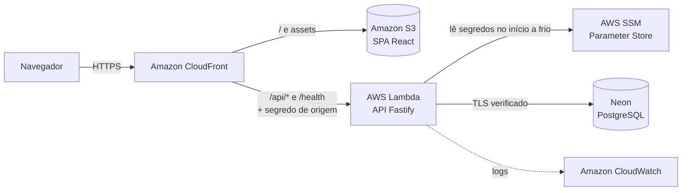

# Memorization

Trabalho da cadeira **AGL11091 - Tendências em Engenharia de Software**.

O objetivo principal é **estudar e aplicar Spec-Driven Development (SDD)** com o
[GitHub Spec Kit](https://github.com/github/spec-kit). O produto construído para
exercitar a metodologia é uma aplicação web de estudo por flashcards. A pessoa
cria **Cartões** (Frente e Verso), agrupa-os em **Baralhos** e os pratica em
**Sessões de estudo**, revelando o Verso e declarando se acertou ou errou. Cada
**Usuário** tem o seu próprio acervo.

Cada funcionalidade nasceu de uma especificação e percorreu o fluxo do Spec Kit:
*specify → clarify → plan → tasks → analyze → implement → converge*. O código
só foi escrito depois de a spec, o plano e as tarefas estarem aprovados, e todo
requisito vigente é citado por pelo menos um teste que o verifica.

## Stack

| Camada | Tecnologia |
|---|---|
| Linguagem | TypeScript de ponta a ponta, sobre Node.js 24+ |
| Backend | Fastify, com validação de entrada por Zod |
| Frontend | React com Vite (SPA com navegação por hash) |
| Persistência | Port de armazenamento com dois Adapters: SQLite (`node:sqlite`) na execução local e PostgreSQL (`pg`) na nuvem |
| Segurança | Senha com sal por Usuário, HMAC-SHA256 com segredo do servidor e scrypt; Credencial enviada em toda requisição, sem sessão nem cookie |
| Testes | Vitest e Testing Library; E2E com Playwright em navegador real, contra API e banco reais |
| Infraestrutura | AWS provisionada com OpenTofu; banco PostgreSQL no Neon |
| Desenvolvimento com IA | [Claude Code](https://claude.com/claude-code) como Arquiteto e orquestrador: conduz o Spec Kit, decide a arquitetura, revisa e integra. O código é escrito por **workers DeepSeek flash**, cada um em worktree isolado |
| Prompts | [`prompts.md`](prompts.md) reúne todos os prompts usados pelo Product Owner para conduzir o projeto |

Scripts principais do backend:

| Script | Uso |
|---|---|
| `npm run dev` | Desenvolvimento local com SQLite |
| `npm run build:local` / `start:local` | Pacote e execução local com SQLite |
| `npm run build:cloud` / `migrate:cloud` / `start:cloud` | Pacote, migração e execução com PostgreSQL (`DB_URL`) |
| `npm run build:lambda` | Pacote da função AWS Lambda (`dist-lambda.zip`) |

## Entrega na AWS

A aplicação publicada está em **<https://d2mp2j3zeufjr0.cloudfront.net>**.

## Arquitetura



- **CloudFront** é a porta única. Serve o SPA a partir do S3 e encaminha
  `/api/*` à Lambda, removendo o prefixo `/api` na borda. Também injeta um
  segredo de origem, sem o qual a Lambda responde 403.
- **Lambda** executa a mesma API do modo local, sem escutar porta alguma.
- **SSM** guarda os três segredos: a URL do banco, o segredo de origem e o
  segredo das Senhas.
- **Neon** hospeda o PostgreSQL. As migrações rodam por comando separado, antes
  do deploy.

O passo a passo da publicação está em
[`specs/011-hospedagem-aws/quickstart.md`](specs/011-hospedagem-aws/quickstart.md)
e em [`backend/terraform/README.md`](backend/terraform/README.md).

## Estrutura padrão de uma spec

Cada funcionalidade tem o seu diretório em `specs/NNN-nome/`, gerado e mantido
pelos comandos do Spec Kit. Todos seguem a mesma estrutura:

| Arquivo | Papel |
|---|---|
| `spec.md` | **O quê e por quê**: histórias de usuário, cenários de aceitação, requisitos funcionais (`FR-xxx`), critérios de sucesso (`SC-xxx`) e esclarecimentos do Product Owner. Não trata de tecnologia |
| `checklists/requirements.md` | Checklist de qualidade da spec: completude, testabilidade e ausência de detalhes de implementação |
| `plan.md` | **Como**: decisões técnicas, Modules e Interfaces, conferência contra a constituição, riscos e estrutura de pastas |
| `research.md` | Cada decisão técnica relevante, com justificativa e alternativas descartadas |
| `data-model.md` | Entidades, campos, restrições e migrações |
| `contracts/` | Contratos observáveis: rotas HTTP, Interfaces de Module, scripts |
| `quickstart.md` | Roteiro de validação ponta a ponta, com comandos e resultados esperados |
| `tasks.md` | Tarefas pequenas e ordenadas, com dependências, testes e matriz de rastreabilidade entre requisitos e tarefas |

Além delas, a constituição (abaixo) reúne os princípios que valem para todas as
specs, e [`CONTEXT.md`](CONTEXT.md) é o glossário do domínio.

## Constituição

A [constituição](.specify/memory/constitution.md) (em
[`.specify/memory/`](.specify/memory/)) é a lei acima das specs. O `plan` de
cada feature a confere princípio a princípio, e o `analyze` trata uma violação
como bloqueio.

| Princípio | Em resumo |
|---|---|
| I. Spec-Driven Development (não negociável) | Nada é implementado antes de spec, clarify, plan, tasks e analyze aprovados. Onde código e spec divergem, a spec vence |
| II. Auditabilidade Append-Only | Toda sessão fica registrada no `SESSION.md`, sem reescrever eventos anteriores e sem segredos |
| III. Domínio Antes de Tecnologia | O `CONTEXT.md` é o glossário e manda na linguagem. O código usa os mesmos termos |
| IV. Módulos Profundos | Interfaces pequenas escondendo muita implementação. Uma Seam só existe quando há pelo menos dois Adapters reais |
| V. A Interface é a Superfície de Teste | Os testes passam pela mesma Interface que quem a chama e verificam resultados observáveis, nunca estado interno |
| VI. Verificação Sobre Afirmação | Nenhuma afirmação de worker é aceita sem o Arquiteto inspecionar o diff e rodar os testes |
| VII. Escopo Mínimo Honesto | Implementa-se só o que a spec pede. Premissas não validadas ficam explícitas |
| VIII. Segredos Fora do Repositório (não negociável) | Nenhum segredo entra em arquivo versionado, sob nenhuma justificativa |
| IX. Rastreabilidade Requisito–Teste | Todo requisito tem um teste que o exercita, e todo teste tem um requisito que o justifica |
| X. Portões de Qualidade | Uma inconsistência crítica no `analyze` ou um checklist reprovado bloqueia o `implement` |
| XI. Delegação Obrigatória de Código (não negociável) | Todo código de aplicação é escrito por workers DeepSeek. O Arquiteto especifica, revisa e integra |

## Specs criadas

| Spec | Do que trata |
|---|---|
| [`specs/001-criar-cartao/`](specs/001-criar-cartao/) | Criar e listar Cartões, com limites de tamanho, persistência, acessibilidade e uso em telefone. Estabelece a base do projeto |
| [`specs/002-criar-baralho/`](specs/002-criar-baralho/) | Criar e listar Baralhos. Introduz as migrações versionadas do esquema |
| [`specs/003-vincular-cartao-baralho/`](specs/003-vincular-cartao-baralho/) | Vincular Cartões a Baralhos (um Cartão pode estar em vários). Um Baralho é elegível para estudo quando tem pelo menos um Cartão |
| [`specs/004-sessao-de-estudo/`](specs/004-sessao-de-estudo/) | Sessão de estudo com ordem aleatória, sem repetição, Revelação do Verso, Resultado e Resumo. Nada é persistido |
| [`specs/005-editar-cartao-e-baralho/`](specs/005-editar-cartao-e-baralho/) | Editar Cartão e renomear Baralho, preservando os Vínculos |
| [`specs/006-excluir-cartao-e-baralho/`](specs/006-excluir-cartao-e-baralho/) | Excluir Cartão ou Baralho com confirmação. Os Vínculos saem em cascata e a outra entidade é preservada |
| [`specs/007-criar-usuario/`](specs/007-criar-usuario/) | Cadastro de Usuário. A Senha é guardada com sal, HMAC com segredo do servidor e scrypt, de forma que um vazamento não a revele |
| [`specs/008-entrar/`](specs/008-entrar/) | Entrar e Sair. A Credencial fica só na memória da página e segue em toda requisição, e cada Usuário vê apenas o próprio acervo |
| [`specs/009-porta-de-persistencia/`](specs/009-porta-de-persistencia/) | Port and Adapter para a persistência, com o Adapter SQLite e a escolha do banco por parâmetro na construção |
| [`specs/010-postgresql-na-nuvem/`](specs/010-postgresql-na-nuvem/) | Adapter PostgreSQL por URL, com TLS verificado, comando de migração e scripts de nuvem |
| [`specs/011-hospedagem-aws/`](specs/011-hospedagem-aws/) | Hospedagem na AWS: função Lambda, segredos no SSM, segredo de origem, pacote da função e publicação |

## SESSION.md

[`SESSION.md`](SESSION.md) é o **registro auditável** do projeto. Cada interação
relevante vira um evento numerado, com data e hora, ator, comando do Spec Kit
usado, decisão tomada, verificações executadas e commit correspondente. Os
eventos anteriores não são reescritos, e nenhum segredo é registrado. É ali que
fica o histórico das decisões do Product Owner e do Arquiteto.

## Como executar localmente

```bash
export SEGREDO_DAS_SENHAS="$(openssl rand -hex 32)"   # mantenha o mesmo para a mesma base
cd backend && npm install && npm run dev               # API em 127.0.0.1:3001 com SQLite
cd frontend && npm install && npm run dev              # abrir o endereço impresso pelo Vite
```

### Apresentação local (um comando)

Na raiz do repositório, `npm run demo` instala as dependências que faltarem, cria
o segredo do servidor, empacota e sobe a API (SQLite) e o frontend, espera os
dois responderem e imprime o endereço a abrir: **<http://127.0.0.1:5173>**. Os
dados ficam em `backend/memorizacao.sqlite`, então o acervo de uma apresentação
continua na seguinte, e `Ctrl+C` encerra API e frontend juntos.

## Verificação

```bash
cd backend  && npm test && npm run typecheck && npm run build:local && npm run lint
cd frontend && npm test && npm run build && npm run lint
npm run test:e2e                                   # na raiz, em navegador real
tofu -chdir=backend/terraform validate
```
