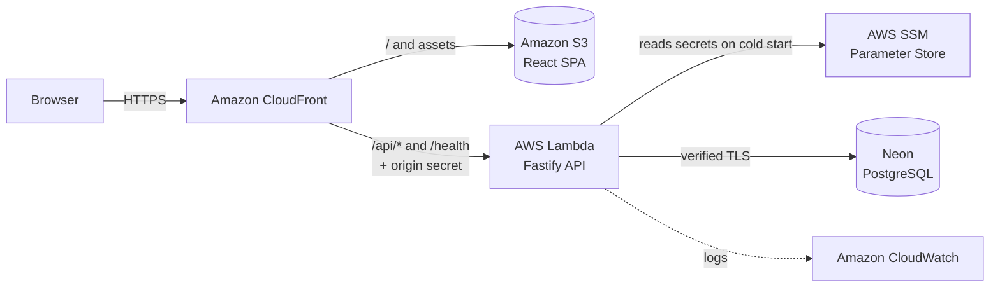

# Memorization

**[Leia em português / Read this in Portuguese](README.pt-BR.md)**

Memorization is a flashcard study web application. A person creates **Cards**
(Front and Back), groups them into **Decks**, studies them in **Study sessions**
and reviews them with **spaced repetition**, so that each Card comes back right
before it would be forgotten. Each **User** has their own private collection.

It was built for the course **AGL11091 - Trends in Software Engineering**, using
Spec-Driven Development with [GitHub Spec Kit](https://github.com/github/spec-kit):
every feature started from a specification in [`specs/`](specs/).

- **Application**: <https://d2mp2j3zeufjr0.cloudfront.net>
- **Presentation**: <https://claude.ai/artifact/JrKYwYHpCGipXnW7ePwKfN>

> The specs, the domain glossary and the code use Portuguese terms (`Cartão`,
> `Baralho`, `Sessão de estudo`, `Usuário`, `Senha`, `Credencial`). This README
> translates them as Card, Deck, Study session, User, Password and Credential.

## What you can do

| Area | What the product offers | Spec |
|---|---|---|
| Account | Sign up with a name and Password, sign in and sign out. Each User sees only their own collection | [007](specs/007-criar-usuario/), [008](specs/008-entrar/) |
| Stay signed in | A temporary Access keeps the person signed in while they use the app and expires after a period of inactivity | [018](specs/018-acesso-temporario/) |
| Manage the account | Rename the User, change the Password and permanently delete the account with all its data | [017](specs/017-gerenciar-conta-usuario/) |
| Cards | Create, list, edit and delete Cards, with size limits | [001](specs/001-criar-cartao/), [005](specs/005-editar-cartao-e-baralho/), [006](specs/006-excluir-cartao-e-baralho/) |
| Decks | Create, rename and delete Decks, and link a Card to several Decks | [002](specs/002-criar-baralho/), [003](specs/003-vincular-cartao-baralho/), [005](specs/005-editar-cartao-e-baralho/), [006](specs/006-excluir-cartao-e-baralho/) |
| Study a Deck | Cards in random order, reveal the Back, rate the answer and see a Summary at the end | [004](specs/004-sessao-de-estudo/) |
| Spaced repetition | SM-2 with a four-level rating; the daily Review gathers due Cards and a limited number of new ones; the algorithm and the daily limit are Preferences | [015](specs/015-repeticao-espacada/) |
| Study schedule | Weekly Routines per Deck (for example, "English every Monday"), today's commitments and a week calendar showing what was done | [016](specs/016-agendamento-de-estudo/) |
| Home and Study | Home shows a greeting, a 7-day summary, the daily Review and today's schedule; the Study area holds the week, statistics and recent Sessions | [019](specs/019-inicio-e-estudo/) |
| Statistics and history | Items studied, Sessions completed and hit rate over the last 7 days, a daily chart and the record of each Session, with what was right and wrong | [013](specs/013-estatisticas-e-historico/) |
| Interface | Navigable interface for phone and desktop (360 to 1440 px, 200% zoom), usable by keyboard and screen reader | [012](specs/012-interface-visual-navegavel/) |

The remaining specs cover the platform: persistence Port with SQLite and
PostgreSQL ([009](specs/009-porta-de-persistencia/),
[010](specs/010-postgresql-na-nuvem/)), AWS hosting
([011](specs/011-hospedagem-aws/)) and continuous integration and delivery
([014](specs/014-ci-cd/)). [`CONTEXT.md`](CONTEXT.md) is the domain glossary.

## Running locally

```bash
export SEGREDO_DAS_SENHAS="$(openssl rand -hex 32)"   # keep the same one for the same database
cd backend && npm install && npm run dev               # API on 127.0.0.1:3001 with SQLite
cd frontend && npm install && npm run dev              # open the address printed by Vite
```

### Local demo (one command)

At the repository root, `npm run demo` installs any missing dependencies, creates
the server secret, bundles and starts the API (SQLite) and the frontend, waits
for both to respond and prints the address to open: **<http://127.0.0.1:5173>**.
The data lives in `backend/memorizacao.sqlite`, so the collection from one demo
carries over to the next, and `Ctrl+C` stops the API and the frontend together.

### Optional environment variables

| Variable | Default | Purpose |
| --- | --- | --- |
| `ORIGEM_DO_FRONTEND` | `http://127.0.0.1:5173` | The exact origin the API grants CORS (with credentials) to, for the temporary Access cookie. |
| `ACESSO_VALIDADE_SEGUNDOS` | `300` | Sliding validity of the temporary Access, in seconds (a positive integer). It is an environment setting, never a user choice. |
| `ORIGENS_LOCAIS_DE_TESTE` | unset | `sim` lets any loopback port through CORS. **Only for the end-to-end tests**, where the frontend starts after the API. |

## Stack

| Layer | Technology |
|---|---|
| Language | TypeScript end to end, on Node.js 24+ |
| Backend | Fastify, with input validation by Zod |
| Frontend | React with Vite (SPA with hash navigation) |
| Persistence | Storage Port with two Adapters: SQLite (`node:sqlite`) when running locally and PostgreSQL (`pg`) in the cloud |
| Security | Password with a per-User salt, HMAC-SHA256 with a server secret and scrypt; temporary Access in an `HttpOnly`, `SameSite=Strict` cookie with sliding expiry |
| Tests | Vitest and Testing Library; E2E with Playwright in a real browser, against the real API and database |
| Infrastructure | AWS provisioned with OpenTofu; PostgreSQL database on Neon |
| Development | [Claude Code](https://claude.com/claude-code) as Architect, driving Spec Kit and reviewing every change; application code written by DeepSeek flash workers |

Main backend scripts:

| Script | Use |
|---|---|
| `npm run dev` | Local development with SQLite |
| `npm run build:local` / `start:local` | Local bundle and run with SQLite |
| `npm run build:cloud` / `migrate:cloud` / `start:cloud` | Bundle, migration and run with PostgreSQL (`DB_URL`) |
| `npm run build:lambda` | AWS Lambda function package (`dist-lambda.zip`) |

## Architecture


```mermaid
flowchart LR
    U[Browser] -->|HTTPS| CF[Amazon CloudFront]
    CF -->|/ and assets| S3[(Amazon S3<br/>React SPA)]
    CF -->|/api/* and /health<br/>+ origin secret| L[AWS Lambda<br/>Fastify API]
    L -->|reads secrets on cold start| SSM[AWS SSM<br/>Parameter Store]
    L -->|verified TLS| DB[(Neon<br/>PostgreSQL)]
    L -.->|logs| CW[Amazon CloudWatch]
```

- **CloudFront** is the single entry point. It serves the SPA from S3 and
  forwards `/api/*` to the Lambda, stripping the `/api` prefix at the edge. It
  also injects an origin secret, without which the Lambda answers 403.
- **Lambda** runs the same API as the local mode, without listening on any port.
- **SSM** holds the three secrets: the database URL, the origin secret and the
  Password secret.
- **Neon** hosts PostgreSQL. Migrations run through a separate command, before
  the deployment.

The step-by-step deployment guide is in
[`specs/011-hospedagem-aws/quickstart.md`](specs/011-hospedagem-aws/quickstart.md)
and in [`backend/terraform/README.md`](backend/terraform/README.md).

## Constitution

The [constitution](.specify/memory/constitution.md) gathers the principles that
apply to every feature.

| Principle | In short |
|---|---|
| I. Spec-Driven Development (non-negotiable) | Nothing is implemented before spec, clarify, plan, tasks and analyze are approved. Where code and spec diverge, the spec wins |
| II. Append-Only Auditability | Decisions are recorded in each feature's `research.md`, in the Spec Kit artifacts and in the commit messages, without rewriting history and without secrets |
| III. Domain Before Technology | `CONTEXT.md` is the glossary and governs the language. The code uses the same terms |
| IV. Deep Modules | Small Interfaces hiding a lot of implementation. A Seam only exists when there are at least two real Adapters |
| V. The Interface Is the Test Surface | Tests go through the same Interface as its callers and check observable results, never internal state |
| VI. Verification Over Assertion | No worker claim is accepted without the Architect inspecting the diff and running the tests |
| VII. Honest Minimal Scope | Only what the spec asks for is implemented. Unvalidated assumptions are made explicit |
| VIII. Secrets Out of the Repository (non-negotiable) | No secret goes into a versioned file, under any justification |
| IX. Requirement–Test Traceability | Every requirement has a test that exercises it, and every test has a requirement that justifies it |
| X. Quality Gates | A critical inconsistency in `analyze` or a failed checklist blocks `implement` |
| XI. Mandatory Code Delegation (non-negotiable) | All application code is written by DeepSeek workers. The Architect specifies, reviews and integrates |

## Verification

```bash
cd backend  && npm test && npm run typecheck && npm run build:local && npm run lint
cd frontend && npm test && npm run build && npm run lint
npm run test:e2e                                   # at the root, in a real browser
npm run verificar:ci                               # at the root: the full gate run before every push
tofu -chdir=backend/terraform validate
```
