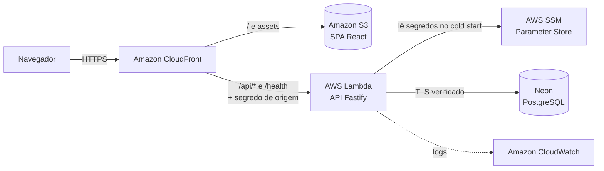

# Memorization

**[Read this in English / Leia em inglês](README.md)**

O Memorization é uma aplicação web de estudo com cartões de memorização. A
pessoa cria **Cartões** (Frente e Verso), agrupa-os em **Baralhos**, estuda em
**Sessões de estudo** e revisa com **repetição espaçada**, para que cada Cartão
volte pouco antes de ser esquecido. Cada **Usuário** tem o próprio acervo,
privado.

Foi construído para a disciplina **AGL11091 - Tendências em Engenharia de
Software**, com Spec-Driven Development pelo
[GitHub Spec Kit](https://github.com/github/spec-kit): toda feature nasceu de
uma especificação em [`specs/`](specs/).

- **Aplicação**: <https://d2mp2j3zeufjr0.cloudfront.net>
- **Apresentação**: <https://claude.ai/artifact/JrKYwYHpCGipXnW7ePwKfN>

## O que dá para fazer

| Área | O que o produto oferece | Spec |
|---|---|---|
| Conta | Criar conta com nome e Senha, Entrar e Sair. Cada Usuário vê só o próprio acervo | [007](specs/007-criar-usuario/), [008](specs/008-entrar/) |
| Continuar conectado | Um Acesso temporário mantém a pessoa conectada enquanto usa o app e expira após um período sem atividade | [018](specs/018-acesso-temporario/) |
| Gerenciar a conta | Renomear o Usuário, trocar a Senha e excluir definitivamente a conta com todos os dados | [017](specs/017-gerenciar-conta-usuario/) |
| Cartões | Criar, listar, editar e excluir Cartões, com limites de tamanho | [001](specs/001-criar-cartao/), [005](specs/005-editar-cartao-e-baralho/), [006](specs/006-excluir-cartao-e-baralho/) |
| Baralhos | Criar, renomear e excluir Baralhos, e vincular um Cartão a vários Baralhos | [002](specs/002-criar-baralho/), [003](specs/003-vincular-cartao-baralho/), [005](specs/005-editar-cartao-e-baralho/), [006](specs/006-excluir-cartao-e-baralho/) |
| Estudar um Baralho | Cartões em ordem aleatória, revelar o Verso, avaliar a resposta e ver um Resumo ao final | [004](specs/004-sessao-de-estudo/) |
| Repetição espaçada | SM-2 com Avaliação em quatro níveis; a Revisão do dia reúne os Cartões vencidos e um número limitado de novos; o algoritmo e o limite diário são Preferências | [015](specs/015-repeticao-espacada/) |
| Agenda de estudo | Rotinas semanais por Baralho (por exemplo, «Inglês toda segunda»), os Compromissos de hoje e um calendário da semana com o que foi feito | [016](specs/016-agendamento-de-estudo/) |
| Início e Estudo | O Início mostra saudação, resumo de 7 dias, a Revisão do dia e a Agenda de hoje; a área Estudo reúne a semana, as Estatísticas e as últimas Sessões | [019](specs/019-inicio-e-estudo/) |
| Estatísticas e histórico | Itens estudados, Sessões concluídas e Taxa de acerto nos últimos 7 dias, gráfico por dia e o Registro de cada Sessão, com acertos e erros | [013](specs/013-estatisticas-e-historico/) |
| Interface | Interface navegável no celular e no desktop (360 a 1440 px, zoom de 200%), utilizável por teclado e leitor de tela | [012](specs/012-interface-visual-navegavel/) |

As demais specs cobrem a plataforma: Porta de persistência com SQLite e
PostgreSQL ([009](specs/009-porta-de-persistencia/),
[010](specs/010-postgresql-na-nuvem/)), hospedagem na AWS
([011](specs/011-hospedagem-aws/)) e integração e entrega contínuas
([014](specs/014-ci-cd/)). [`CONTEXT.md`](CONTEXT.md) é o glossário do domínio.

## Como executar localmente

```bash
export SEGREDO_DAS_SENHAS="$(openssl rand -hex 32)"   # mantenha o mesmo para o mesmo banco
cd backend && npm install && npm run dev               # API em 127.0.0.1:3001 com SQLite
cd frontend && npm install && npm run dev              # abra o endereço impresso pelo Vite
```

### Apresentação local (um comando)

Na raiz do repositório, `npm run demo` instala o que faltar, cria o segredo do
servidor, empacota e inicia a API (SQLite) e o frontend, espera os dois
responderem e imprime o endereço a abrir: **<http://127.0.0.1:5173>**. Os dados
ficam em `backend/memorizacao.sqlite`, então o acervo de uma apresentação passa
para a seguinte, e `Ctrl+C` encerra a API e o frontend juntos.

### Variáveis de ambiente opcionais

| Variável | Padrão | Finalidade |
| --- | --- | --- |
| `ORIGEM_DO_FRONTEND` | `http://127.0.0.1:5173` | A origem exata à qual a API concede CORS (com credenciais), para o cookie do Acesso temporário. |
| `ACESSO_VALIDADE_SEGUNDOS` | `300` | Validade deslizante do Acesso temporário, em segundos (inteiro positivo). É configuração do ambiente, nunca escolha do Usuário. |
| `ORIGENS_LOCAIS_DE_TESTE` | não definida | `sim` libera no CORS qualquer porta de loopback. **Só para os testes ponta a ponta**, em que o frontend sobe depois da API. |

## Stack

| Camada | Tecnologia |
|---|---|
| Linguagem | TypeScript de ponta a ponta, em Node.js 24+ |
| Backend | Fastify, com validação de entrada por Zod |
| Frontend | React com Vite (SPA com navegação por hash) |
| Persistência | Porta de armazenamento com dois Adapters: SQLite (`node:sqlite`) ao executar localmente e PostgreSQL (`pg`) na nuvem |
| Segurança | Senha com sal por Usuário, HMAC-SHA256 com segredo do servidor e scrypt; Acesso temporário em cookie `HttpOnly` e `SameSite=Strict` com validade deslizante |
| Testes | Vitest e Testing Library; E2E com Playwright em navegador real, contra a API e o banco reais |
| Infraestrutura | AWS provisionada com OpenTofu; banco PostgreSQL no Neon |
| Desenvolvimento | [Claude Code](https://claude.com/claude-code) como Arquiteto, conduzindo o Spec Kit e revisando cada mudança; código da aplicação escrito por workers DeepSeek flash |

Principais scripts do backend:

| Script | Uso |
|---|---|
| `npm run dev` | Desenvolvimento local com SQLite |
| `npm run build:local` / `start:local` | Pacote e execução locais com SQLite |
| `npm run build:cloud` / `migrate:cloud` / `start:cloud` | Pacote, migração e execução com PostgreSQL (`DB_URL`) |
| `npm run build:lambda` | Pacote da função AWS Lambda (`dist-lambda.zip`) |

## Arquitetura



- **CloudFront** é a única entrada. Serve a SPA a partir do S3 e encaminha
  `/api/*` para a Lambda, retirando o prefixo `/api` na borda. Também injeta um
  segredo de origem, sem o qual a Lambda responde 403.
- **Lambda** executa a mesma API do modo local, sem escutar porta nenhuma.
- **SSM** guarda os três segredos: a URL do banco, o segredo de origem e o
  segredo das Senhas.
- **Neon** hospeda o PostgreSQL. As migrações rodam por um comando separado,
  antes da entrega.

O passo a passo da entrega está em
[`specs/011-hospedagem-aws/quickstart.md`](specs/011-hospedagem-aws/quickstart.md)
e em [`backend/terraform/README.md`](backend/terraform/README.md).

## Constituição

A [constituição](.specify/memory/constitution.md) reúne os princípios que valem
para todas as features.

| Princípio | Em resumo |
|---|---|
| I. Spec-Driven Development (inegociável) | Nada é implementado antes de spec, clarify, plan, tasks e analyze aprovados. Onde código e spec divergem, vale a spec |
| II. Auditabilidade append-only | As decisões ficam no `research.md` de cada feature, nos artefatos do Spec Kit e nas mensagens de commit, sem reescrever a história e sem segredos |
| III. Domínio antes da tecnologia | `CONTEXT.md` é o glossário e governa a linguagem. O código usa os mesmos termos |
| IV. Módulos profundos | Interfaces pequenas escondendo muita implementação. Um Seam só existe quando há ao menos dois Adapters reais |
| V. A Interface é a superfície de teste | Os testes passam pela mesma Interface de quem a usa e verificam resultados observáveis, nunca estado interno |
| VI. Verificação acima de afirmação | Nenhuma afirmação de worker é aceita sem o Arquiteto inspecionar o diff e rodar os testes |
| VII. Escopo mínimo e honesto | Só se implementa o que a spec pede. Premissas não validadas ficam explícitas |
| VIII. Segredos fora do repositório (inegociável) | Nenhum segredo entra em arquivo versionado, sob nenhuma justificativa |
| IX. Rastreabilidade requisito–teste | Todo requisito tem um teste que o exercita, e todo teste tem um requisito que o justifica |
| X. Portões de qualidade | Uma inconsistência crítica no `analyze` ou um checklist reprovado bloqueia o `implement` |
| XI. Delegação obrigatória de código (inegociável) | Todo código de aplicação é escrito por workers DeepSeek. O Arquiteto especifica, revisa e integra |

## Verificação

```bash
cd backend  && npm test && npm run typecheck && npm run build:local && npm run lint
cd frontend && npm test && npm run build && npm run lint
npm run test:e2e                                   # na raiz, em navegador real
npm run verificar:ci                               # na raiz: o portão completo antes de todo push
tofu -chdir=backend/terraform validate
```
