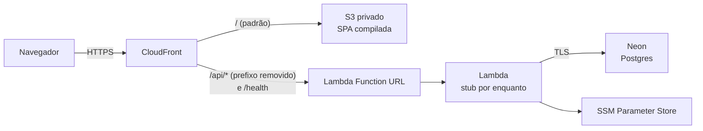

# Infra AWS — memorization

Mesmo stack do `~/Coding/cineclube`: CloudFront na frente de um S3 privado (SPA)
e de uma Lambda (API), Postgres no Neon, segredos no SSM Parameter Store.

> O código é versionado; `terraform.tfstate`, `terraform.tfvars` e `.terraform/`
> não (`.gitignore` deste diretório). O state é local, aqui mesmo: faça backup
> dele — perder o state deixa os recursos órfãos na conta.



A Lambda sobe com a **stub** de `stub/index.mjs` até o backend ter um handler
de Lambda. O que falta no código está em [`aws_pendencias.md`](../../aws_pendencias.md).

## Pré-requisitos

- OpenTofu (`tofu`) >= 1.11 e AWS CLI v2
- perfil AWS do `robot` (`export AWS_PROFILE=robot-account` se não for o default)
- projeto no Neon e a connection string dele

## Permissões do robot

O `robot` só opera recursos pelo nome. A policy que libera `memorization-*`
está em [`iam/robot-memorization-deploy.json`](iam/robot-memorization-deploy.json)
e é anexada como inline por um perfil admin. `put-user-policy` substitui o
documento inteiro, então este arquivo é a fonte da verdade:

```bash
aws iam put-user-policy --profile root --user-name robot \
  --policy-name memorization-deploy \
  --policy-document file://iam/robot-memorization-deploy.json
```

## Subir

A ordem completa, com o porquê de cada passo, está no manual de operação
[`specs/011-hospedagem-aws/quickstart.md`](../../specs/011-hospedagem-aws/quickstart.md).
Em resumo, da raiz do repositório:

```bash
cp backend/terraform/terraform.tfvars.example backend/terraform/terraform.tfvars   # preencha db_conn_string (fora do git)
# 1. migrar o Neon pelo endpoint DIRETO (sem "-pooler"): DDL e trava consultiva
(cd backend && npm run build:cloud && DB_URL='<url-do-endpoint-direto>' npm run migrate:cloud)
# 2. empacotar a função (dist-lambda.zip, sem segredo algum)
(cd backend && npm run build:lambda)
# 3. aplicar a infra com o pacote real
tofu -chdir=backend/terraform init
tofu -chdir=backend/terraform apply -var lambda_package=../dist-lambda.zip -var lambda_handler=lambda.handler
# 4. publicar o SPA (npm run build:aws, com a API em /api)
(cd backend/terraform && ./scripts/deploy-frontend.sh)
```

Sem `-var lambda_package`, o apply volta para a stub. A função **nunca migra**:
se o esquema estiver atrasado, ela recusa servir (503) até o passo 1 ser feito.

## Verificar

```bash
curl -s "$(tofu output -raw health_url)"               # {"status":"ok"}
curl -si "$(tofu output -raw function_url)health"      # 403: não veio pelo CloudFront
curl -si "$(tofu output -raw api_url)/cartoes"         # 401: acervo exige a Credencial
aws logs tail /aws/lambda/memorization-api --since 10m
```

Validação completa: cadastrar um Usuário, Entrar e criar um Cartão pelo
endereço do CloudFront, com Nome de usuário e Senha gerados na hora.

## Desempenho

A Senha é verificada em toda requisição (não há sessão), então cada operação
paga uma derivação scrypt. `lambda_memory_mb` tem padrão de **1769 MB**, um vCPU
inteiro. Medição em 2026-09-21, pelo CloudFront, a partir do Brasil:
- a 1024 MB, o p95 de um GET autenticado foi de 0,99 s;
- a 1769 MB, foi de 0,81 s;
- o `/health`, sem derivação, teve mediana de 0,65 s, ou seja, a rede domina.

O remédio para latência é memória, nunca enfraquecer o hash.

## Operação do Neon

- **Runtime**: o endpoint pooled (`-pooler`) em `db_conn_string`.
- **Migrações**: o endpoint direto, informado só no comando.
- O TLS é sempre verificado contra a cadeia pública; URLs com
  `sslmode=disable`, `allow` ou `prefer` são recusadas.
- A configuração do projeto pela CLI do Neon (`neon link`, `neon config init`)
  exige login interativo. Ela não faz parte do fluxo automatizado e não é
  necessária para subir a aplicação.

## Trocar um segredo

Os segredos são *write-only* (não vão para o state), então o Tofu não percebe
mudança sozinho. Altere o `terraform.tfvars` e suba a versão:

```bash
tofu apply -var secrets_version=2
```

`ORIGIN_SECRET` é gerado aqui: `tofu apply -replace=random_password.origin_secret -var secrets_version=N`.

## Derrubar

```bash
aws s3 rm "s3://$(tofu output -raw site_bucket)" --recursive
tofu destroy
```
