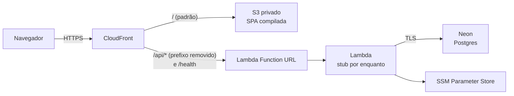

# Infra AWS — memorization

Mesmo stack do `~/Coding/cineclube`: CloudFront na frente de um S3 privado (SPA)
e de uma Lambda (API), Postgres no Neon, segredos no SSM Parameter Store.

> O código é versionado; `terraform.tfstate`, `terraform.tfvars` e `.terraform/`
> não (`.gitignore` deste diretório). O state é local, aqui mesmo: faça backup
> dele — perder o state deixa os recursos órfãos na conta.



A Lambda sobe com a **stub** de `stub/index.mjs` até o backend ter um handler
de Lambda. O que falta no código está em [`aws_pendencias.md`](../../aws_pendencias.md).

## Pré-requisitos

- OpenTofu (`tofu`) >= 1.11 e AWS CLI v2
- perfil AWS do `robot` (`export AWS_PROFILE=robot-account` se não for o default)
- projeto no Neon e a connection string dele

## Permissões do robot

O `robot` só opera recursos pelo nome. A policy que libera `memorization-*`
está em [`iam/robot-memorization-deploy.json`](iam/robot-memorization-deploy.json)
e é anexada como inline por um perfil admin. `put-user-policy` substitui o
documento inteiro, então este arquivo é a fonte da verdade:

```bash
aws iam put-user-policy --profile root --user-name robot \
  --policy-name memorization-deploy \
  --policy-document file://iam/robot-memorization-deploy.json
```

## Subir

```bash
cp terraform.tfvars.example terraform.tfvars   # preencha db_conn_string
tofu init
tofu plan
tofu apply
./scripts/deploy-frontend.sh                    # build com VITE_ENDERECO_DA_API=/api
```

## Verificar

```bash
curl -s "$(tofu output -raw health_url)"             # {"status":"ok"}
curl -si "$(tofu output -raw function_url)health"    # 403: não veio pelo CloudFront
curl -si "$(tofu output -raw api_url)/cartoes"       # 503 da stub
aws logs tail /aws/lambda/memorization-api --since 10m
```

## Publicar a API real

Quando `backend/src/lambda.ts` existir:

```bash
./scripts/build-lambda.sh
tofu apply -var lambda_package=../dist-lambda.zip -var lambda_handler=lambda.handler
```

Sem `-var lambda_package`, o apply volta para a stub.

## Trocar um segredo

Os segredos são *write-only* (não vão para o state), então o Tofu não percebe
mudança sozinho. Altere o `terraform.tfvars` e suba a versão:

```bash
tofu apply -var secrets_version=2
```

`ORIGIN_SECRET` é gerado aqui: `tofu apply -replace=random_password.origin_secret -var secrets_version=N`.

## Derrubar

```bash
aws s3 rm "s3://$(tofu output -raw site_bucket)" --recursive
tofu destroy
```
