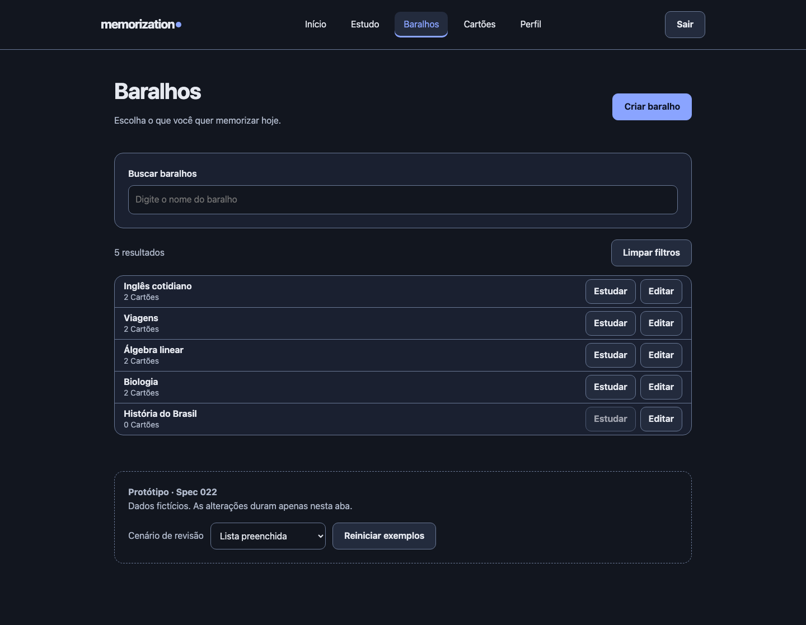
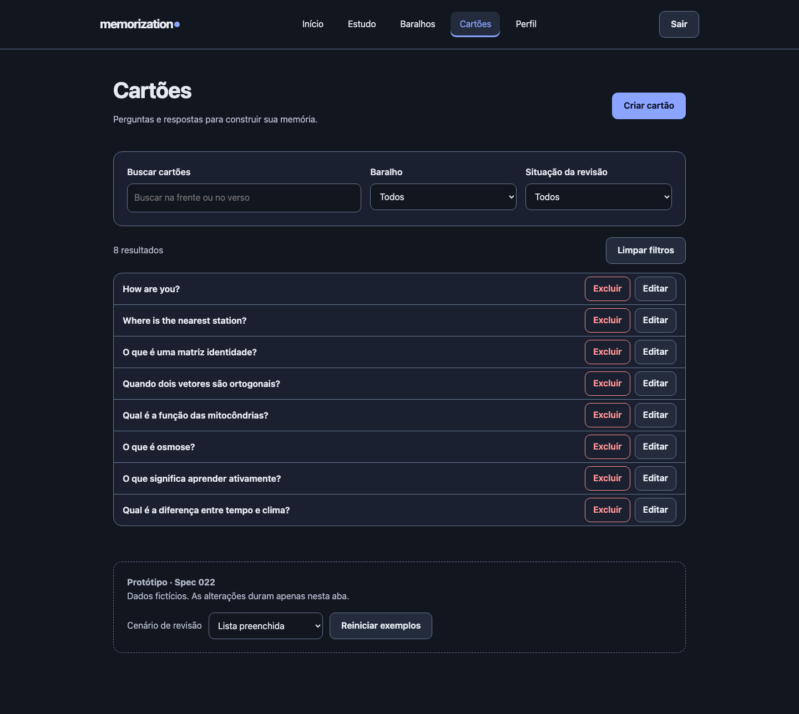

# Protótipos navegáveis — 022

O Usuário solicitou protótipos das duas telas após a criação da especificação. O artefato está em [Abrir protótipo](../../design/busca-e-filtros/index.html), com instruções em [README](../../design/busca-e-filtros/README.md).

## Baralhos

Cabeçalho existente com Criar baralho → busca pelo nome → contagem e Limpar filtros → lista compacta com nome, quantidade e Estudar → Editar.

## Cartões

Cabeçalho existente com Criar cartão → busca na Frente ou no Verso → seletor de Baralho → seletor de situação → contagem e Limpar filtros → lista compacta com Frente e Excluir → Editar.

No desktop, os três controles ficam na mesma linha. No celular, ficam empilhados com rótulos visíveis. Resultados mantêm Verso e vínculos fora da linha, como na spec 021.

[Cartões no celular](../../design/busca-e-filtros/capturas/cartoes-390.png) · [Baralhos no celular](../../design/busca-e-filtros/capturas/baralhos-390.png) · [Filtros combinados](../../design/busca-e-filtros/capturas/cartoes-filtrados-1440.png) · [Sem resultados](../../design/busca-e-filtros/capturas/cartoes-sem-resultados-390.png).

## Estados e limites

A galeria permite revisar carregamento, falha com nova tentativa, acervo vazio e ausência de correspondências. Busca, filtros e exclusão demonstrativa funcionam com dados fictícios na memória. Demais ações apenas indicam que seguem fluxos existentes fora do escopo deste protótipo.

O protótipo não implementa a feature no produto e não substitui os requisitos da spec. Situações de revisão são exemplos fixos; os testes do protótipo não comprovam integração, cálculo de Agendamento ou isolamento de usuários da aplicação.
